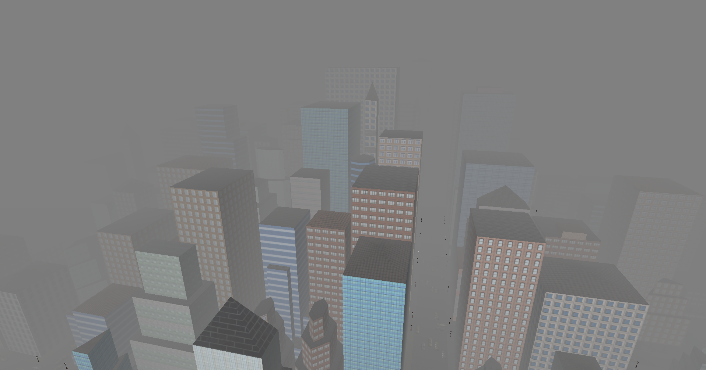
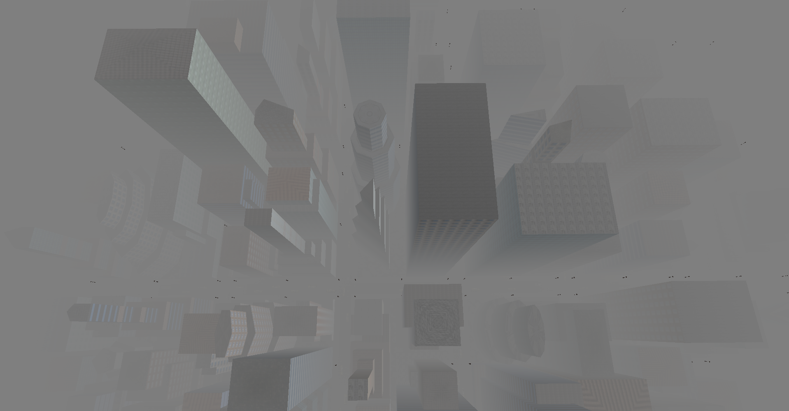
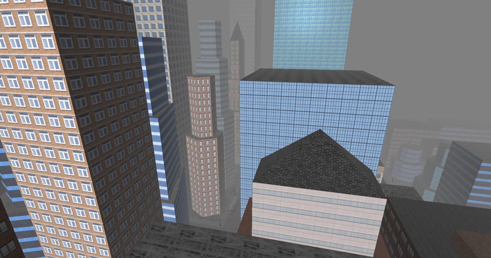
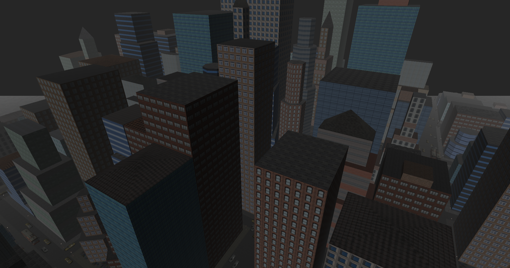
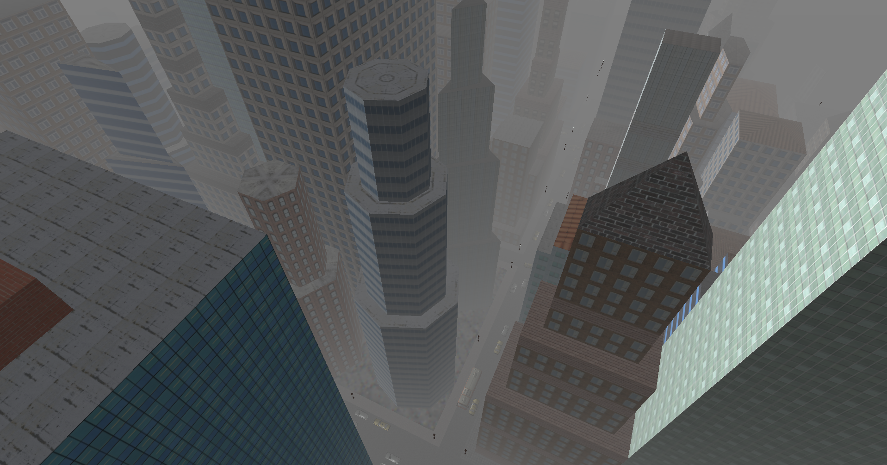
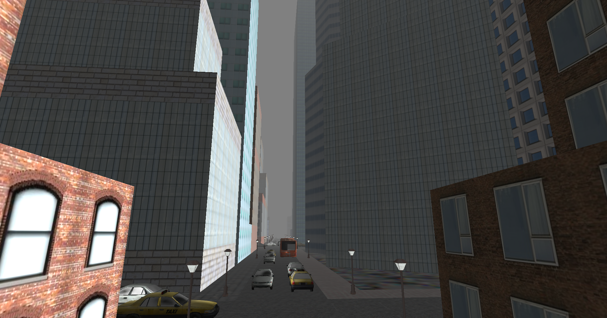

## Procedurally generated city with modern OpenGL and C++.
# 

## Features
- Adjustable world dimensions. Can generate a world of arbitrary user defined size.
- Non-uniform terrain. The streets, blocks and alleys are generated using recursions and randomeness which gives a non-uniform look to the world.

- Phong illumination model implemented in the fragment shader.

- Realistic day-night transitioning using directional light.

- Realistic fog using exponential squared formula and illumination dependent fog density.

- Traffic

- Collision detection between world objects and the viewer, i.e. the camera using spatial subdivision.

## Libraries and frameworks
- [OpenGLUtil](https://github.com/hrachyahakobyan/OpenGLUtil)
- [GLFW](http://www.glfw.org/)
- [GLEW](http://glew.sourceforge.net/)
- [GLM](http://glm.g-truc.net/0.9.8/index.html)
- [SOIL](http://www.lonesock.net/soil.html)
- [ASSIMP](http://assimp.sourceforge.net/)
